# Go Solo database

The executable schema, indexes, foreign keys, and seed rows are in `install.sql`. Import that file in phpMyAdmin. This note explains what the tables are for.

The database is MySQL or MariaDB, InnoDB, `utf8mb4`.

There are no fictional members, Out There stories, or campfire conversations in the seed data. The starting account is the founder. Waypoints, the seed shelf, and the reading room are real site content.

## Starting account

| Email | Password | Role |
| --- | --- | --- |
| marge@gosolo.co.network | change-this-chair | admin |

Change the password after the first login. The hash in `install.sql` is bcrypt.

## Roles and statuses

`users.role`: `member`, `moderator`, `admin`.

`users.status`: `active`, `suspended`, `banned`. A person who is not active cannot stay signed in.

SAME requests: `open`, `archived`.

SAME matches: `suggested`, `approved`, `archived`. A steward suggests the match. Nothing pairs people automatically.

Skill offers, requests, and links use `archived` as 0 or 1.

Growing seeds: `active`, `resting`.

Stories, campfire posts, and comments use `hidden` as 0 or 1. Hidden writing stays visible to its author and to a steward.

Reading articles: `draft`, `published`.

Contact messages: `unread`, `replied`, `archived`.

Reports: `pending`, `reviewed`, `dismissed`.

## Relationships

```mermaid
erDiagram
  users ||--|| profiles : has
  users ||--o{ password_resets : requests
  users ||--o{ planted_seeds : plants
  users ||--o{ growing_seeds : tends
  users ||--o{ help_requests : asks
  users ||--o{ help_offers : offers
  users ||--o{ support_preferences : prefers
  users ||--o{ same_requests : opens
  users ||--o{ stories : writes
  users ||--o{ campfire_posts : starts
  users ||--o{ comments : adds
  users ||--o{ reports : files
  users ||--o{ notices : receives
  users ||--o{ activity : does
  users ||--o{ waypoint_members : sits
  seeds ||--o{ planted_seeds : chosen
  seeds ||--o{ same_requests : about
  seeds ||--o{ same_matches : for
  users ||--o{ same_matches : "partner A"
  users ||--o{ same_matches : "partner B"
  users ||--o{ skill_offers : teaches
  users ||--o{ skill_requests : learns
  skill_offers ||--o{ skill_links : connects
  skill_requests ||--o{ skill_links : connects
  waypoints ||--o{ waypoint_members : holds
  reading_categories ||--o{ readings : shelves
  users ||--o{ private_notes : writes
```

`same_matches.user_a_id` and `user_b_id` both point at `users`. Deleting a member removes their profile, seeds, stories, comments, and notes. A seed or skill post used by a match can be removed without deleting the match: those foreign keys use `ON DELETE SET NULL`. A reading category cannot be deleted while an article still sits on it.

`private_notes.context_type` is `same` or `skill`. `context_id` is the match or the skill link. It is not a foreign key, because it can point at either table. Notes are shown only while that match or link is still current.

## Tables

| Table | What it holds |
| --- | --- |
| users | Login, role, status, last seen |
| profiles | Garden: name, bio, location, photograph, contact rhythm |
| password_resets | Hashed reset token, two-hour expiry |
| settings | Site words, colours, image paths, mail template |
| waypoints | Independence Lab, Solo Among Others, Emotional Clarity, and later ones |
| waypoint_members | Who has chosen to sit with a waypoint |
| seeds | The shelf: SAME, Skill Swap, and smaller futures |
| planted_seeds | A member beginning a shelf seed |
| growing_seeds | Seeds a member names themselves |
| help_requests | Seeds I'd Like Help Growing |
| help_offers | Seeds I'm Happy To Help Plant |
| support_preferences | Accountability, Medical Buddy, Practical Life, Connection, Starting Over, Confidence |
| same_requests | A member who is open to a partner |
| same_matches | A steward's suggestion, later approved or archived |
| skill_offers | Something a member can teach |
| skill_requests | Something a member wants to learn |
| skill_links | Two members a steward connected |
| stories | Out There. What they did, expected, what happened, and whether they would do it again |
| campfire_posts | A conversation |
| comments | Notes on a campfire conversation |
| reports | A member asking a steward to look |
| warnings | A note the member can see |
| moderator_notes | A note only the desk can see |
| contact_messages | Notes sent from the contact page |
| reading_categories | Living Well, Connection, Starting Over, Independent Living, Out There, Reflections |
| readings | Practical articles, draft or published |
| notices | A quiet line for one member |
| activity | A short history for the desk |
| private_notes | A note between two people who were matched or connected |

Contact frequency stored on a profile is one of: Daily, Several times per week, Weekly, Bi-weekly, Monthly, As needed.

Check-in style is one of: Messages, Voice notes, Video calls, Email, Any format.

## Indexes and foreign keys

Every table uses InnoDB. Primary keys, unique slugs, and the foreign keys named in `install.sql` are created there. Lookups that the desk repeats are indexed: email, status, created date, last seen, hidden stories, open SAME requests, report status, and notes for one member.

Seed rows for settings, waypoints, seeds, six reading categories, and 27 published articles are at the bottom of `install.sql`.

## Room update

An existing database picks up discussions, replies, photographs, and reading-room links by importing `update-rooms.sql` once in phpMyAdmin. That file is additive. It does not drop tables or rewrite Out There answers.

It records `rooms-2026-10-08` in `schema_updates`. The application checks for `stories.body` and `waypoint_posts` before using the new rooms. It does not apply the update during a normal page request.

`stories.body` holds the open story used by new Out There posts. `what_i_did`, `expectations`, `what_happened`, and `would_do_again` stay in place. A story with `body` renders that field. A story without it still renders the four older answers.

`waypoint_readings` links a reading to a waypoint. One article can sit with several waypoints, and one waypoint can hold several articles, in `sort_order`. Deleting an article or a waypoint removes the link. A draft article stays in the link table and stays off the public page until it is published.

`waypoint_posts` are discussions in a chair. Replies use `comments` with `target_type` `story`, `campfire`, or `waypoint`. Photographs live in `content_images`, not in the article text. Uploaded files stay under `uploads/covers/`, which refuses to run PHP.
