# Go Solo database

The executable schema, indexes, foreign keys, and seed rows are in `install.sql`. Import that file in phpMyAdmin. This note explains what the tables are for.

The database is MySQL or MariaDB, InnoDB, `utf8mb4`.

There are no fictional members, Out There stories, or campfire conversations in the seed data. The starting account is the founder. Waypoints, the seed shelf, and the reading room are real site content.

## Starting account

| Email | Password | Role |
| --- | --- | --- |
| marge@gosolo.co.network | change-this-chair | admin |

Change the password after the first login. The hash in `install.sql` is bcrypt.

## Roles and statuses

`users.role`: `member`, `moderator`, `admin`.

`users.status`: `active`, `suspended`, `banned`. A person who is not active cannot stay signed in.

SAME requests: `open`, `archived`.

SAME matches: `awaiting`, `open`, `closed`, `declined`, `archived`. Older rows may still say `suggested` or `approved` until `update-life.sql` is imported. A steward may suggest an introduction. Both people agree before it is open. Nothing pairs people automatically.

Skill offers and requests: `open`, `paused`, `completed`, `archived`. `archived` as 0 or 1 stays in step with the archived status. Links still use `archived` as 0 or 1.

Growing seeds: `active` (shown as Growing), `resting` (On hold), `grown`, `archived`.

Outcomes: `none`, `offered`, `review`, `permission`, `approved`, `published`, `withdrawn`, `declined`. Offering a reflection does not publish it.

Conversations keep `requested`, `open`, and `declined`. `member_closed` is a member's close. `closed` is still the steward rest. Archive, mute, and “served its purpose” belong to one participant.

Stories, campfire posts, and comments use `hidden` as 0 or 1. Hidden writing stays visible to its author and to a steward.

Reading articles: `draft`, `published`.

Contact messages: `unread`, `replied`, `archived`.

Reports: `pending`, `reviewed`, `dismissed`. A report may also keep a category, a resolution note, and who acted.

## Account deletion

There is no account-export page. Deleting an account runs `DELETE FROM users`. Rows that belong to that person cascade away: seeds, skill listings, outcomes, journey hides, notices, and participant rows.

Shared rows try not to keep a deleted person's name. `lifecycle_events.user_id`, seed `status_by`, skill `status_by`, introduction `closed_by`, conversation `closed_by`, and report `acted_by` use `ON DELETE SET NULL`. An introduction itself is removed if either person deletes their account, because both people are foreign keys on that row. A conversation is removed if the person who opened it deletes their account. The other person's messages go with that conversation. A public story deletion removes the story; an outcome that pointed at it stays with its author and is no longer tied to a public page.

Suspending a member keeps their records and their pause choices. It does not publish private reflections.

## Relationships

```mermaid
erDiagram
  users ||--|| profiles : has
  users ||--o{ password_resets : requests
  users ||--o{ planted_seeds : plants
  users ||--o{ growing_seeds : tends
  users ||--o{ help_requests : asks
  users ||--o{ help_offers : offers
  users ||--o{ support_preferences : prefers
  users ||--o{ same_requests : opens
  users ||--o{ stories : writes
  users ||--o{ campfire_posts : starts
  users ||--o{ comments : adds
  users ||--o{ reports : files
  users ||--o{ notices : receives
  users ||--o{ activity : does
  users ||--o{ waypoint_members : sits
  seeds ||--o{ planted_seeds : chosen
  seeds ||--o{ same_requests : about
  seeds ||--o{ same_matches : for
  users ||--o{ same_matches : "partner A"
  users ||--o{ same_matches : "partner B"
  users ||--o{ skill_offers : teaches
  users ||--o{ skill_requests : learns
  skill_offers ||--o{ skill_links : connects
  skill_requests ||--o{ skill_links : connects
  waypoints ||--o{ waypoint_members : holds
  reading_categories ||--o{ readings : shelves
  users ||--o{ private_notes : writes
```

`same_matches.user_a_id` and `user_b_id` both point at `users`. Deleting a member removes their profile, seeds, stories, comments, and notes. A seed or skill post used by a match can be removed without deleting the match: those foreign keys use `ON DELETE SET NULL`. A reading category cannot be deleted while an article still sits on it.

`private_notes.context_type` is `same` or `skill`. `context_id` is the match or the skill link. It is not a foreign key, because it can point at either table. Notes are shown only while that match or link is still current.

## Tables

| Table | What it holds |
| --- | --- |
| users | Login, role, status, last seen |
| profiles | Garden: name, bio, location, photograph, contact rhythm, and whether private conversations are open |
| password_resets | Hashed reset token, two-hour expiry |
| settings | Site words, colours, image paths, mail template. `updated_at` records the last save when that column is present |
| waypoints | Independence Lab, Solo Among Others, Emotional Clarity, and later ones. Optional copy columns: `intro_line`, `food_intro`, `discussion_prompt`, `discussion_cta`, `discussion_empty` |
| waypoint_members | Who has chosen to sit with a waypoint |
| seeds | The shelf: SAME, Skill Swap, and smaller futures |
| planted_seeds | A member beginning a shelf seed |
| growing_seeds | Seeds a member names themselves |
| help_requests | Seeds I'd Like Help Growing |
| help_offers | Seeds I'm Happy To Help Plant |
| support_preferences | Accountability, Medical Buddy, Practical Life, Connection, Starting Over, Confidence |
| same_requests | A member who is open to a partner |
| same_matches | A steward's suggestion, later approved or archived |
| skill_offers | Something a member can teach |
| skill_requests | Something a member wants to learn |
| skill_links | Two members a steward connected |
| stories | Out There. What they did, expected, what happened, and whether they would do it again |
| campfire_posts | A conversation |
| comments | Notes on a campfire conversation |
| reports | A member asking a steward to look |
| warnings | A note the member can see |
| moderator_notes | A note only the desk can see |
| contact_messages | Notes sent from the contact page |
| reading_categories | Living Well, Connection, Starting Over, Independent Living, Out There, Reflections |
| readings | Practical articles, draft or published |
| notices | A quiet line for one member |
| activity | A short history for the desk |
| private_notes | A note between two people who were matched or connected |
| conversations | A private conversation with a seed, skill, introduction, or waypoint |
| conversation_participants | The two members in a conversation |
| conversation_messages | The notes in a conversation |

Contact frequency stored on a profile is one of: Daily, Several times per week, Weekly, Bi-weekly, Monthly, As needed.

Check-in style is one of: Messages, Voice notes, Video calls, Email, Any format.

## Indexes and foreign keys

Every table uses InnoDB. Primary keys, unique slugs, and the foreign keys named in `install.sql` are created there. Lookups that the desk repeats are indexed: email, status, created date, last seen, hidden stories, open SAME requests, report status, and notes for one member.

Seed rows for settings, waypoints, seeds, six reading categories, and 27 published articles are at the bottom of `install.sql`.

## Room update

An existing database picks up discussions, replies, photographs, and reading-room links by importing `update-rooms.sql` once in phpMyAdmin. That file is additive. It does not drop tables or rewrite Out There answers.

It records `rooms-2026-10-08` in `schema_updates`. The application checks for `stories.body` and `waypoint_posts` before using the new rooms. It does not apply the update during a normal page request.

`stories.body` holds the open story used by new Out There posts. `what_i_did`, `expectations`, `what_happened`, and `would_do_again` stay in place. A story with `body` renders that field. A story without it still renders the four older answers.

`waypoint_readings` links a reading to a waypoint. One article can sit with several waypoints, and one waypoint can hold several articles, in `sort_order`. Deleting an article or a waypoint removes the link. A draft article stays in the link table and stays off the public page until it is published.

`waypoint_posts` are discussions in a chair. Replies use `comments` with `target_type` `story`, `campfire`, or `waypoint`. Photographs live in `content_images`, not in the article text. Uploaded files stay under `uploads/covers/`, which refuses to run PHP.

## Private conversations

An existing database picks up private conversations by importing `update-talk.sql` once. It records `talk-2026-10-08` in `schema_updates`.

`profiles.conversations_pref` is `anyone`, `context`, or `none`. Existing members stay on `context` until they save a choice. `conversations_choice_made` records that save. `profiles.conversations_held` is set by a steward when private conversations need to rest.

A first note is a request (`conversations.status` `requested`) until the other person accepts. A declined request keeps the row so the same sender cannot ask again, and the opening note is removed unless a report is already attached. `member_blocks` stops private contact in either direction.

A conversation belongs to a seed, a skill offer or request, a skill link, an introduction, a waypoint discussion, a campfire note, an Out There story, or a direct hello when the other person allows anyone. Sitting in the same waypoint is not enough. `context_id` is not a foreign key, because it can point at more than one table. The label and the introduction lines are stored on the conversation so they remain if the original post changes.

Only the two participants can read the notes. A steward sees participants and context after a report, and opens the notes only with a recorded look. `reports.target_type` includes `conversation`. A photograph on a note uses `content_images.parent_type` `conversation`.
